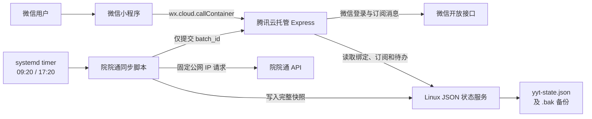

# 院院通待办提醒小程序

院院通待办提醒小程序是一套面向小范围内部用户的待办查询与微信提醒系统。用户通过微信登录并绑定自己的院院通用户 ID，只能查看该 ID 对应的最新待办数据；用户主动授权订阅消息后，系统会在数据同步完成时按需发送微信服务通知。

当前生产架构由微信小程序、腾讯云托管 Express 后端和具有固定公网 IP 的 Linux 服务器组成。系统不依赖 MySQL 或 COS，最新业务状态保存在 Linux 服务器的 JSON 文件中，适合数据量小、每天同步次数少、不需要长期报表的场景。

## 当前能力

- 真实微信登录，通过 `wx.login` 和微信 `code2Session` 获取用户身份。
- 只允许使用 6 位以上纯数字院院通用户 ID 绑定。
- 不支持手机号、邮箱或其他身份字段绑定。
- 用户数据严格按绑定的院院通用户 ID 隔离。
- 小程序只保留“首页”和“我的”两个主要栏目。
- 首页展示当前用户最新一次同步得到的待办数量和提醒内容。
- Linux 服务器每天北京时间 `09:20`、`17:20` 自动拉取院院通 API。
- 用户主动授权后，可接收一次性微信订阅消息。
- 同一数据批次和同一消息具有幂等保护，避免重复提醒。
- 用户绑定、订阅次数和最新待办保存在远程 JSON 状态文件中。
- 腾讯云托管容器重启、缩容或重新部署不会造成业务状态丢失。
- 支持同步日志、健康检查、状态文件备份和故障诊断。

## 系统架构



### 组件职责

| 组件 | 主要职责 |
| --- | --- |
| 微信小程序 | 微信登录、绑定用户 ID、订阅授权、展示本人最新待办 |
| 腾讯云托管 | 身份校验、数据隔离、订阅管理、批次处理、调用微信发送消息 |
| Linux 固定 IP 服务器 | 请求院院通 API、定时同步、保存 JSON 状态、记录同步日志 |
| 微信开放接口 | `code2Session`、Access Token、订阅消息发送 |
| GitHub | 保存代码并触发腾讯云托管后端 CI/CD |

### 当前云托管标识

| 配置 | 当前值 |
| --- | --- |
| 小程序 AppID | `wx964c3e4ac820ac37` |
| 云托管环境 ID | `prod-d5g6lfndn063b2d5d` |
| 云托管服务名称 | `express-0kx6` |
| 容器端口 | `80` |

小程序通过 `wx.cloud.callContainer` 访问云托管，不再通过 `wx.request` 访问云托管测试域名，因此体验版和正式版不需要把 `*.sh.run.tcloudbase.com` 配置为小程序 request 合法域名。

阿里云同步脚本仍然通过云托管公网地址调用导入触发接口，这属于服务器到服务器通信，不受小程序合法域名限制。

## 核心运行流程

### 1. 登录与绑定

1. 小程序调用 `wx.login` 获取临时 code。
2. 后端调用微信 `code2Session` 换取真实 `openid`。
3. 已绑定用户直接获得业务 Token。
4. 未绑定用户获得短期 bind token，并进入绑定页面。
5. 绑定接口只接受 `/^\d{6,}$/` 格式的院院通用户 ID。
6. 一个院院通用户 ID 不能同时绑定多个微信账号。
7. 后端每次请求都会重新读取用户记录；用户记录被删除后，旧 Token 立即失效。

业务 Token 只保存必要的内部用户 ID、签发时间、过期时间和类型，不包含院院通账号或 `openid`。

### 2. 数据同步

1. Linux 的两个 systemd timer 分别在北京时间 `09:20` 和 `17:20` 启动同一个同步服务。
2. 同步脚本使用固定公网 IP 和 Bearer API Key 请求院院通 API。
3. 脚本执行分页、超时、重试、重复 ID 去重和最大页数保护。
4. 本次数据生成唯一 `batch_id`，由时间戳和数据摘要组成。
5. 完整待办快照写入 Linux JSON 状态服务。
6. Linux 只向腾讯云托管提交小型触发请求：

```json
{
  "batch_id": "唯一批次号",
  "trigger_reminders": true
}
```

7. 云托管根据 `batch_id` 从 Linux 状态服务读取最新快照。
8. 同一 `batch_id` 重复触发时不会重复处理或重复发消息。

### 3. 数据展示

- 首页查询时，后端强制使用当前登录用户绑定的院院通用户 ID。
- 客户端传入的其他 `userId` 不会改变查询范围。
- 系统只展示最新快照，不提供长期历史统计。
- 下一次同步前，用户持续看到上一次成功同步的数据。
- 如果尚无正式数据且 `TODO_SAMPLE_FALLBACK_ENABLED=true`，系统可以展示一条明确标注为示例的数据。
- 第一批正式数据写入后，示例数据自动停止展示。

### 4. 微信订阅消息

1. 用户首次绑定后进入“储备提醒次数”页面，也可以从“我的”页面再次进入。
2. 页面以 10 次为短期测试目标，允许用户随时跳过进入首页。
3. 用户每点击一次“储备 1 次提醒”，小程序只调用一次 `wx.requestSubscribeMessage`。
4. 只有微信返回 `accept` 的服务器允许模板 ID 才会计入可用次数。
5. 同一个短期 `request_id` 只能提交一次；页面在每次授权完成后预取下一次配置。
6. 新数据批次到达后，系统只选择以下用户：
   - 院院通用户 ID 与快照中的 `userId` 完全一致；
   - `pendingCount > 0`；
   - 对当前模板仍有可用订阅次数。
7. 消息发送成功后扣减一次可用次数。
8. 消息通常显示在微信“服务通知”中，点击后进入小程序首页。

微信当前使用一次性订阅消息。勾选“总是保持以上选择，不再询问”后，后续有效点击通常不再显示授权弹窗，但每次点击仍只补充一次额度。10 次储备按每天两次提醒计算，理论上约可覆盖 5 天，不能视为永久订阅。

## 数据存储

生产模式使用：

```text
STORAGE_MODE=remote-json
```

Linux 默认状态文件：

```text
/opt/yyt-state/yyt-state.json
/opt/yyt-state/yyt-state.json.bak
```

JSON 状态版本为 v2，主要保存：

- 用户与 `openid` 的绑定关系；
- 用户绑定的院院通用户 ID；
- 按模板记录的订阅可用次数；
- 最新一次待办快照；
- 最近批次处理状态；
- 有限数量的最近发送结果。

状态服务将所有修改放入单一写队列，并使用“临时文件、磁盘同步、备份旧文件、原子替换”流程写入。主文件损坏时会尝试读取 `.bak`；主文件和备份同时损坏时服务进入错误状态，不会自动生成空文件覆盖原数据。

该方案适合当前低频、低并发、只需要最新状态的业务。它不适合高并发写入、长期历史分析或复杂报表。

## 项目结构

```text
.
├─ app.js / app.json              小程序入口和页面配置
├─ pages/                         登录、绑定、首页、详情、我的
├─ components/                    小程序公共组件
├─ services/                      小程序请求、登录和业务 API
├─ utils/                         配置、存储、权限和数据标准化
├─ server/
│  ├─ src/                        腾讯云托管 Express 后端
│  └─ tests/                      后端、同步和部署测试
├─ scripts/
│  ├─ sync-todo-to-cloud.js       正式院院通同步入口
│  ├─ remote-state-server.js      Linux JSON 状态服务
│  ├─ validate-deploy-config.js   AppID 部署预检
│  └─ yyt-*.example              systemd 与环境变量示例
├─ deploy/aliyun-test/            阿里云一键安装、更新和诊断包
├─ docs/                          架构、API、环境变量和部署文档
├─ Dockerfile                     腾讯云托管容器构建
├─ container.config.json          云托管实例配置
└─ project.config.json            微信开发者工具项目配置
```

虽然仓库中保留部分早期页面、MySQL、COS 和 mock 兼容代码，当前生产主链路不依赖这些能力。

## 运行环境

### 本地开发

- Windows 10/11
- Node.js 18 或更高版本
- 微信开发者工具
- 基础库支持 `wx.cloud`
- 已关联当前小程序的腾讯云托管环境

### 腾讯云托管

- Express.js / Node.js
- Docker 构建
- Node.js 20 Alpine 镜像
- 容器端口 `80`
- 最小实例数默认 `0`，最大实例数 `5`

最小实例数为 `0` 时会产生冷启动，长时间无人访问后的首次请求可能稍慢。如果内部用户对首次响应速度敏感，可以把最小实例数改为 `1`，但会持续产生费用。

### Linux 同步服务器

- 具有固定公网 IPv4
- Node.js 18 或更高版本
- 支持 systemd
- 院院通 API 白名单已加入该服务器公网 IP
- 可访问院院通 API、腾讯云托管和微信相关网络

## 本地开发与检查

安装依赖：

```powershell
cd "C:\Users\Zhengquanbu\项目管理\WeChat_programm_project\NeuroGaze_MiniProgram"
npm install
cd server
npm install
cd ..
```

运行部署预检：

```powershell
npm run preflight
```

运行小程序请求层和完整后端测试：

```powershell
npm test
```

只运行小程序云托管请求测试：

```powershell
npm run test:miniprogram
```

检查项目结构：

```powershell
node scripts/validate-structure.js
```

本地启动后端时，应在 `server/.env` 使用测试配置，不要把真实密钥提交到仓库：

```powershell
npm start
```

## 微信开发者工具

导入目录：

```text
C:\Users\Zhengquanbu\项目管理\WeChat_programm_project\NeuroGaze_MiniProgram
```

导入后确认：

1. AppID 为 `wx964c3e4ac820ac37`。
2. 编译基础库支持 `wx.cloud`。
3. 项目没有选择 `dist`、`server` 或 `deploy` 子目录作为小程序根目录。
4. 编译后能够进入登录页面。
5. 真机登录、绑定、首页和“我的”页面均可访问。

`project.config.json` 已忽略后端、部署包、测试、依赖和日志目录，避免上传小程序时出现 Node.js 脚本非法文件错误。

## 腾讯云托管部署

选择 Express.js 服务，使用仓库根目录的 `Dockerfile` 构建，服务端口填写 `80`。

推荐生产环境变量：

```json
{
  "PORT": "80",
  "NODE_ENV": "production",
  "MOCK_MODE": "false",
  "ALLOWED_ORIGINS": "*",
  "ENABLE_EGRESS_IP_CHECK": "false",

  "TODO_DATA_SOURCE": "import",
  "TODO_SAMPLE_FALLBACK_ENABLED": "false",
  "TODO_IMPORT_TOKEN": "<与Linux同步任务一致的强随机密钥>",

  "STORAGE_MODE": "remote-json",
  "REMOTE_STATE_API_BASE_URL": "<Linux状态服务地址>",
  "REMOTE_STATE_TOKEN": "<与Linux状态服务一致的强随机密钥>",
  "REMOTE_STATE_TIMEOUT_MS": "10000",

  "REMINDER_SCHEDULE_ENABLED": "false",
  "REMINDER_TIME_ZONE": "Asia/Shanghai",
  "REMINDER_FETCH_PAGE_SIZE": "100",
  "REMINDER_SEND_ONLY_PENDING": "true",

  "WECHAT_APP_ID": "wx964c3e4ac820ac37",
  "WECHAT_APP_SECRET": "<微信公众平台AppSecret>",
  "WECHAT_API_BASE_URL": "http://api.weixin.qq.com",
  "WECHAT_SUBSCRIBE_TEMPLATE_ID": "<订阅消息模板ID>",
  "WECHAT_SUBSCRIBE_TEMPLATE_PAGE": "pages/index/index",
  "WECHAT_SUBSCRIBE_TEMPLATE_FIELDS": "{\"time\":\"time11\",\"content\":\"thing1\"}",

  "APP_TOKEN_SECRET": "<独立的强随机业务Token密钥>"
}
```

关键原则：

- `TODO_IMPORT_TOKEN`：只用于 Linux 调用云托管导入和提醒接口。
- `REMOTE_STATE_TOKEN`：只用于访问 Linux JSON 状态服务。
- `APP_TOKEN_SECRET`：只用于签发小程序用户登录 Token。
- 三个密钥用途不同，必须使用不同随机值。
- `WECHAT_APP_SECRET`、院院通 API Key 和所有业务密钥不得提交 GitHub。
- `REMINDER_SCHEDULE_ENABLED=false`，避免云托管定时器与 Linux systemd 重复运行。
- `TODO_DATA_SOURCE=import`，云托管不直接请求院院通 API。
- `ENABLE_EGRESS_IP_CHECK` 仅排障时临时开启。

部署完成后检查：

```text
GET https://<云托管公网地址>/health
```

预期结果应包含：

```json
{
  "ready": true,
  "login_ready": true,
  "reasons": []
}
```

如果微信云托管开启了“开放接口服务”，云端可使用 `http://api.weixin.qq.com` 私有链路。如果关闭该能力，应根据微信云托管实际网络模式重新验证微信 API 地址和证书链路。

## Linux 一键部署

仓库提供阿里云部署包生成脚本：

```powershell
powershell -ExecutionPolicy Bypass -File scripts/build-aliyun-deploy-package.ps1
```

生成的压缩包上传到 Linux 后：

```bash
tar -xzf yyt-aliyun-test-deploy.tar.gz
cd yyt-aliyun-test-deploy
sudo bash install.sh
```

安装器会：

- 检查服务器公网出口 IP；
- 安装 Node.js 20 和运行依赖；
- 创建低权限 `yyt` 用户；
- 安装 JSON 状态服务；
- 安装每天 `09:20` 和 `17:20` 的 systemd timer；
- 创建权限为 `600` 的环境变量文件；
- 创建状态和日志目录。

一键包默认是安全的本机测试模式：

```text
REMOTE_STATE_HOST=127.0.0.1
CLOUD_TRIGGER_ENABLED=false
TRIGGER_REMINDERS=false
```

要接通完整云端链路，必须在验证本地同步成功后完成以下配置：

1. 让腾讯云托管能够访问 Linux 状态服务。
2. 将 Linux 生成的 `REMOTE_STATE_TOKEN` 配置到腾讯云托管。
3. 将 Linux 生成的 `TODO_IMPORT_TOKEN` 配置到腾讯云托管。
4. 将 `CLOUD_TRIGGER_ENABLED` 改为 `true`。
5. 将 `TRIGGER_REMINDERS` 改为 `true`。
6. 重启状态服务并手动执行一次同步。

### 状态服务网络方式

推荐正式方式：

```text
公网 HTTPS 域名或网关 -> Nginx -> 127.0.0.1:3100
```

无域名测试方式：

```text
腾讯云托管 -> http://<固定公网IP>:3100
```

公网 IP + HTTP 只能作为小范围测试方案，因为 `REMOTE_STATE_TOKEN` 和业务数据在传输层没有 TLS 加密。使用该方式时至少需要：

- 把 `REMOTE_STATE_HOST` 改为 `0.0.0.0`；
- 阿里云安全组增加入方向 TCP `3100`；
- 保持 Bearer Token 鉴权；
- 不在日志、截图或聊天中暴露 Token；
- 条件允许后迁移到 HTTPS。

Linux 本机同步脚本访问状态服务时仍可使用：

```text
REMOTE_STATE_API_BASE_URL=http://127.0.0.1:3100
```

腾讯云托管则使用外部可达地址。

### Linux 环境文件

状态服务：

```bash
# /etc/yyt-remote-state.env
NODE_ENV=production
REMOTE_STATE_HOST=127.0.0.1
REMOTE_STATE_PORT=3100
REMOTE_STATE_FILE=/opt/yyt-state/yyt-state.json
REMOTE_STATE_TOKEN=<强随机远程状态密钥>
```

同步任务：

```bash
# /etc/yyt-todo-sync.env
TZ=Asia/Shanghai
TODO_API_BASE_URL=https://accumedical.aiforce.cloud/app/app_4jwag2n0mjq73
TODO_API_KEY=<院院通APIKey>

REMOTE_STATE_API_BASE_URL=http://127.0.0.1:3100
REMOTE_STATE_TOKEN=<与状态服务一致>

CLOUD_API_BASE_URL=https://<云托管公网地址>
TODO_IMPORT_TOKEN=<与云托管一致>
CLOUD_TRIGGER_ENABLED=true
TRIGGER_REMINDERS=true

TODO_SYNC_LOG_DIR=/var/log/yyt-todo-sync
TODO_SYNC_REQUEST_TIMEOUT_MS=30000
TODO_SYNC_REMOTE_TIMEOUT_MS=15000
TODO_SYNC_CLOUD_TIMEOUT_MS=30000
TODO_SYNC_REQUEST_RETRIES=3
TODO_SYNC_MAX_PAGES=1000
```

环境文件权限：

```bash
sudo chown root:yyt /etc/yyt-remote-state.env /etc/yyt-todo-sync.env
sudo chmod 640 /etc/yyt-remote-state.env /etc/yyt-todo-sync.env
```

## Linux 运维命令

查看服务和定时器：

```bash
sudo systemctl status yyt-remote-state.service
sudo systemctl status yyt-todo-sync.service
sudo systemctl list-timers --all | grep yyt
```

手动同步一次：

```bash
sudo systemctl start yyt-todo-sync.service
```

查看日志：

```bash
sudo journalctl -u yyt-remote-state.service -n 100 --no-pager
sudo journalctl -u yyt-todo-sync.service -n 100 --no-pager
sudo tail -n 100 /var/log/yyt-todo-sync/todo-sync-latest.log
sudo cat /var/log/yyt-todo-sync/todo-sync-latest.json
```

状态服务本机健康检查：

```bash
curl http://127.0.0.1:3100/health
```

更新：

```bash
sudo bash update.sh
```

诊断：

```bash
sudo bash diagnose.sh
```

卸载但保留数据和密钥：

```bash
sudo bash uninstall.sh
```

永久清理前必须先备份：

```bash
sudo cp /opt/yyt-state/yyt-state.json /root/yyt-state.backup.json
sudo bash uninstall.sh --purge
```

## 主要接口

### 小程序用户接口

| 方法 | 路径 | 鉴权 | 作用 |
| --- | --- | --- | --- |
| `POST` | `/api/auth/wechat-login` | 微信临时 code | 微信登录 |
| `POST` | `/api/auth/bind` | bind token | 绑定数字用户 ID |
| `GET` | `/api/user/me` | 用户 Token | 当前用户、订阅和最近状态 |
| `GET` | `/api/todo-stat/snapshots` | 用户 Token | 当前绑定 ID 的最新待办 |
| `GET` | `/api/subscribe/config` | 用户 Token | 获取允许模板和 request_id |
| `POST` | `/api/subscribe` | 用户 Token | 保存微信授权结果 |
| `GET` | `/api/reminders/status` | 用户 Token | 查看最近同步和提醒状态 |

### 服务器接口

| 方法 | 路径 | 鉴权 | 作用 |
| --- | --- | --- | --- |
| `POST` | `/api/todo-stat/import` | `TODO_IMPORT_TOKEN` | 按 batch_id 触发导入与提醒 |
| `POST` | `/api/reminders/run` | `TODO_IMPORT_TOKEN` | 手动处理指定批次 |
| `GET` | `/health` | 无 | 云托管健康检查 |
| `GET` | `/health/egress-ip` | 临时开关 | 排查云托管出口 IP |
| `GET` | `/health/wechat-tls` | 临时开关 | 排查微信 API 网络与证书 |

Linux JSON 状态服务拥有独立业务接口，并全部通过 `REMOTE_STATE_TOKEN` 鉴权。小程序不直接访问状态服务。

## 发布流程

### 后端发布

1. 完成代码修改和测试。
2. 提交并推送 GitHub `master`。
3. 腾讯云托管 CI/CD 流水线自动构建 Docker 镜像。
4. 等待服务版本部署完成。
5. 检查 `/health` 返回 `ready=true`。
6. 查看云托管构建日志和服务日志确认无启动错误。

### 小程序发布

GitHub 推送不会自动发布微信小程序前端。

1. 使用微信开发者工具打开项目根目录。
2. 点击“编译”并进行真机调试。
3. 点击右上角“上传”。
4. 填写版本号和更新说明。
5. 在微信公众平台“版本管理”中将开发版本设为体验版。
6. 添加体验成员并完成小范围测试。
7. 需要正式上线时提交微信审核并发布。

如果只希望小范围使用，可以长期使用体验版并仅添加指定体验成员。体验版用户范围由微信公众平台控制。

## 上线验收

建议按以下顺序完成一次端到端验收：

1. 云托管 `/health` 返回 `ready=true` 和 `login_ready=true`。
2. Linux 状态服务 `/health` 返回健康且状态版本为 v2。
3. Linux 定时器显示下一次 `09:20`、`17:20` 运行时间。
4. 真机微信登录成功。
5. 未绑定用户必须进入绑定页面。
6. 手机号、邮箱、空值和短 ID 绑定均被拒绝。
7. 两个微信用户绑定不同 ID 时只能看到各自数据。
8. 首次绑定后进入提醒储备页，单次点击只增加一次，达到 10 次后停止申请。
9. 手动执行 Linux 同步服务。
10. 首页显示该用户最新待办。
11. 有未处理待办的已订阅用户收到一条微信服务通知。
12. 成功发送后订阅可用次数扣减。
13. 重启云托管容器后，绑定和待办仍然存在。
14. 重启 Linux 状态服务后，状态文件仍可恢复。

## 常见问题

### 体验版提示 `request:fail url not in domain list`

确认当前代码使用 `wx.cloud.callContainer`，并重新在微信开发者工具上传新版本。不要把云托管默认测试域名添加为正式 request 合法域名。

### 小程序上传提示后端脚本非法

必须导入项目根目录，并确认 `project.config.json` 的 `packOptions.ignore` 包含 `server`、`scripts`、`deploy`、`dist` 和 `node_modules`。

### 云托管返回 502 或 SERVICE_NOT_READY

- 检查云托管实例是否从 0 冷启动。
- 查看服务日志是否成功监听 `PORT=80`。
- 检查容器设置端口是否为 `80`。
- 检查 `/health` 的 `reasons`。
- 如需避免冷启动，可将最小实例数设为 `1`。

### 登录失败

- 确认 `WECHAT_APP_ID` 与 `project.config.json` 一致。
- 确认 `WECHAT_APP_SECRET` 有效。
- 确认云托管“开放接口服务”配置与 `WECHAT_API_BASE_URL` 一致。
- 检查 `/health` 中的 `login_ready`。
- 微信登录 code 只能使用一次且有效时间很短。

### 首页没有真实数据

- 确认 `TODO_DATA_SOURCE=import`。
- 检查 Linux 最近同步日志。
- 检查状态服务当前 `batch_id`。
- 确认院院通 API 白名单包含 Linux 公网出口 IP。
- 确认用户绑定 ID 与快照 `userId` 完全一致。

### 点击订阅后没有收到消息

- 点击订阅本身不会立刻发送消息。
- 确认微信授权结果为 `accept`。
- 确认“我的”页面可用次数大于 0。
- 确认同步请求包含 `trigger_reminders=true`。
- 确认该用户 `pendingCount > 0`。
- 确认模板 ID 和字段 `time11`、`thing1` 与微信后台一致。
- 查看“我的”页面最近提醒状态和云托管服务日志。

### 云托管无法访问 Linux 状态服务

- 检查 `REMOTE_STATE_API_BASE_URL` 是否能从公网访问。
- 检查状态服务监听地址是否为外部可达地址。
- 检查阿里云安全组入方向端口。
- 检查 `REMOTE_STATE_TOKEN` 是否一致。
- 检查 Linux 防火墙和 systemd 服务状态。
- 公网 HTTP 只建议测试，正式环境应迁移到 HTTPS。

### 同一批数据重复触发

系统使用 `batch_id` claim 和消息发送键进行幂等控制。相同批次重复请求会返回已处理状态，不会自动重复发送。需要重新测试时，应重新拉取生成新批次，不要直接修改历史状态文件。

## 安全要求

- 所有密钥只放腾讯云环境变量或 Linux `/etc/yyt-*.env`。
- 禁止把 AppSecret、院院通 API Key、导入 Token、远程状态 Token 提交 GitHub。
- 已经在聊天、截图或日志中暴露的密钥必须立即轮换。
- `APP_TOKEN_SECRET`、`TODO_IMPORT_TOKEN`、`REMOTE_STATE_TOKEN` 必须使用不同随机值。
- 正式环境关闭 `MOCK_MODE` 和 `ENABLE_EGRESS_IP_CHECK`。
- 不要公开 JSON 状态文件目录。
- 不要把状态服务鉴权 Token 放入小程序前端。
- 定期备份 `yyt-state.json`，并验证备份可以读取。
- 小程序当前使用纯数字用户 ID 作为绑定凭证，适合受控的小范围用户；如果扩大公众使用，应增加管理员审核、邀请码或二次身份校验。

## 已知限制

- 一次性订阅消息需要用户重复授权，后台不能静默续订。
- JSON 状态服务是单点持久化节点，Linux 磁盘故障会影响全部状态。
- 系统不保存完整历史，不适合长期趋势报表。
- 公网 IP + HTTP 状态服务缺少传输加密，只适合测试。
- 云托管最小实例数为 0 时存在冷启动。
- 绑定规则只校验数字 ID 格式，无法单独证明操作者拥有该院院通账号。
- 当前架构按低频写入设计，不适合高并发公开服务。

## 进一步文档

- [系统架构](docs/architecture.md)
- [API 设计](docs/api-design.md)
- [开发指南](docs/development-guide.md)
- [环境变量示例](docs/env-example.md)
- [固定 IP Linux 部署](docs/fixed-ip-sync.md)
- [腾讯云托管部署](docs/tencent-cloudbase-deploy.md)

## 维护建议

每天关注：

- 两个 systemd timer 是否按时运行；
- `todo-sync-latest.json` 是否更新；
- 院院通 API 是否返回成功；
- 云托管 `/health` 是否就绪。

每周执行：

- 检查 Linux 磁盘空间；
- 备份 `yyt-state.json`；
- 查看同步失败和微信发送失败记录；
- 确认腾讯云托管费用、实例和流水线状态。

每次发布前执行：

```powershell
npm run preflight
npm test
node scripts/validate-structure.js
git status
```

确认测试通过、没有密钥文件进入 Git 暂存区后，再推送 GitHub 和上传小程序版本。
